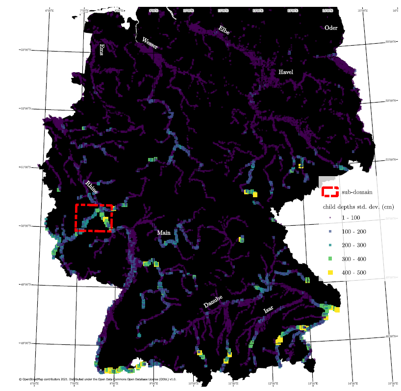

[](https://zenodo.org/badge/latestdoi/682497962)
# Flood Damage Function Aggregation Processing Pipeline and Data Analysis Scripts
scripts for computation and data analysis of potential errors arising from aggregation of different loss functions



## updates
- 2023-10-30: compressed and deleted some outputs. dump of postgres tables

## Use
Project was originally setup for 6 countries

### compute/data
Workflow diagram is here: l:\02_WORK\NRC\2307_funcAgg\04_CALC\2307_funcAgg - pipeline.pptx

Much of aggregation and spatial manipulation is carried out on a postgres server using python scripts. All tables can be generated with the provided scripts/workflow; however, this can be slow. Alternatively, a dump of the db is in the data archive.
All raw data for analysis/plots are read from 2 postgres tables. cache pickles are used also and provided in the data archive.

### data archive
2024-08-28: uploaded a zip to [gdrive.cefskillz](https://drive.google.com/drive/folders/1iGgX0MxeIl3PL_jwQCx6xIRBAD29MWHB?usp=drive_link)


### figures

from `wd_bstats.a03_gstats_{expo_str}_{country_key}`:
- Figure 2:  Germany-wide child depths mean and standard deviation for three levels of grid-aggregation and four hazard scenarios.: `_05depths.da_gstats.plot_gstats()`

The following plots are made primarily from the table `damage.rl_deu_agg`:
- Figure 4: Relative losses for three grid aggregations for the 500-year fluvial undefended hazard scenario and the four selected flood damage functions (Table 1):`_03damage.da_loss.plot_rl_agg_v_bldg(dfid_l=dfunc_curve_l)`
- Figure S2: Relative losses for three grid aggregations and four idealized functions: `_03damage.da_loss.plot_rl_agg_v_bldg(dfid_l=hill_curve_l)`
- Figure 5: Relative losses for a single damage function for the sub-domain: `plot_rl_agg_v_bldg(use_cache=True,samp_frac=1.0,dfid_l=[26],  use_aoi=True,figsize=(18*cm,6*cm))`
- Figure 6: Building count weighted relative losses for three grid aggregations and four flood damage functions for the 500-year fluvial undefended hazard scenario:  `_03damage.da_tloss.plot_TL_agg_v_bldg()`


## install
build conda environment from ./environment.yml

create a ./definitions.py file similar to that shown below

setup a postgress server and add the config info to `postgres_d` in the definitions.py file

 

## Related

- [2210_AggFSyn](https://github.com/cefect/2210_AggFSyn): preliminary work (for ICFM9)

- [2112_Agg](https://github.com/cefect/2112_Agg): original aggregation study (from which the curves work spanwed). This is now limited to grid aggregation.

- [figueiredo2018](https://github.com/cefect/figueiredo2018/tree/cef): damage curve library


### definitions.py
```
#===============================================================================
# SYSTEM CONFIG---------
#===============================================================================
import os, sys

src_dir = os.path.dirname(os.path.abspath(__file__))
src_name = os.path.basename(src_dir)

# default working directory
wrk_dir = r'l:\10_IO\2307_funcAgg'

lib_dir = os.path.join(wrk_dir, 'lib')

temp_dir = os.path.join(wrk_dir, 'temp')
 

# logging configuration file
logcfg_file = os.path.join(src_dir, 'logger.conf')

#latex 
os.environ['PATH'] += R";c:\Users\cefect\AppData\Local\Programs\MiKTeX\miktex\bin\x64"

#===============================================================================
# PARAMETSER-----
#===============================================================================
gridsize_default_l = [30*34, 30*8, 30*2]

#===============================================================================
# indexing data--------
#===============================================================================
#country tiles
index_country_fp_d = {
    'BGD':'BGD_tindex_0725.gpkg',
    'AUS':'AUS_tindex_0824.gpkg',
    'ZAF':'ZAF_tindex_0824.gpkg',
    'BRA':'BRA_tindex_0824.gpkg',
    'CAN':'CAN_tindex_0824.gpkg',
    'DEU':'DEU_tindex_0824.gpkg',    
    }

index_country_fp_d = {k:os.path.join(r'l:\10_IO\2307_funcAgg\ins\indexes', v) for k,v in index_country_fp_d.items()}
 
#===============================================================================
# #OSM data-----------
#===============================================================================
osm_pbf_basedir=os.path.join(wrk_dir, r'ins\osm_20230725')

osm_pbf_data = { #relative
    'BGD':'bangladesh-latest.osm.pbf',
    'AUS':'australia-latest.osm.pbf',
    'DEU':'germany-latest.osm.pbf',
    'CAN':'canada-latest.osm.pbf',
    'ZAF':'south-africa-latest.osm.pbf',
    'BRA':'brazil-latest.osm.pbf'
    }

osm_pbf_data = {k:os.path.join(osm_pbf_basedir, v) for k,v in osm_pbf_data.items()}

osm_cache_dir = os.path.join(osm_pbf_basedir, 'cache')

#add osmium to path
os.environ['PATH'] += r";l:\09_REPOS\02_JOBS\2307_funcAgg\env\funcAgg3\Library\bin"

#===============================================================================
# HAZARD data----------
#===============================================================================
equal_area_epsg = 6933

#hazard tiles
"""these indexes should have a 'location' field with the absolute path to each raster file
the relative path is extracted from this assuming the raster files are in ./raw (relative to the index file)
"""
index_hazard_fp_d ={
    '500_fluvial':r'500_fluvial\tileindex_500_fluvial.gpkg',
    '500_pluvial':r'500_pluvial\tileindex_500_pluvial.gpkg',
    '100_pluvial':r'100_pluvial\tileindex_100_pluvial.gpkg',
    '100_fluvial':r'100_fluvial\tileindex_100_fluvial.gpkg',
    '050_pluvial':r'050_pluvial\tileindex_050_pluvial.gpkg',
    '050_fluvial':r'050_fluvial\tileindex_050_fluvial.gpkg',
    '010_pluvial':r'010_pluvial\tileindex_010_pluvial.gpkg',
    '010_fluvial':r'010_fluvial\tileindex_010_fluvial.gpkg',    
    }

index_hazard_fp_d = {k:os.path.join(r'd:\05_DATA\_jobs\2307_funcAgg\fathom\global3', v) for k,v in index_hazard_fp_d.items()}

haz_label_d = {
    'f500_fluvial': '500-year Fluvial',
    #'f500_pluvial': '500-year Pluvial',
    #'f100_pluvial': '100-year Pluvial',
    'f100_fluvial': '100-year Fluvial',
    #'f050_pluvial': '50-year Pluvial',
    'f050_fluvial': '50-year Fluvial',
    #'f010_pluvial': '10-year Pluvial',
    'f010_fluvial': '10-year Fluvial'
}

#post gis names (TODO: incorporate these earlier as postgres needs a string
#haz_coln_l = ['f010_fluvial', 'f050_fluvial','f100_fluvial', 'f500_fluvial']
haz_coln_l = list(haz_label_d.keys())

fathom_vals_d = {
    -32767.0:'permanent water',
    -32768.0:'nodata'
    }
#===============================================================================
# Damage Functions (figueiredo2018)--------
#===============================================================================
"""NOTE: see funcMetrics.func_prep.py for wagenaar_2018"""
dfunc_base_dir = r'l:\09_REPOS\02_JOBS\2307_funcAgg\data\figueiredo2018'

#export of function database from figueiredo2018
dfunc_fp = os.path.join(dfunc_base_dir, 'csv_dump.xls')

 

#shortening teh 'attributes' value
clean_names_d = {12:'Yazdi (2012)', 45:'Vann. (2006)', 37:'Bud. (2015)', 42:'Dutta. (2003)', 1001:'BN-FLEMOps'}

#===============================================================================
# WhiteBoxTools-----
#===============================================================================
 
sys.path.append(r'l:\09_REPOS\04_FORKS\whitebox-tools\WBT')
 

#===============================================================================
# postgres---------
#===============================================================================
postgres_d = {'dbname':'2307_funcAgg_j', 'user':'python', 'host':'localhost', 'password':'password', 'port':'5432'}
#conn_str = f"dbname=2307_funcAgg user=postgres host=localhost password=password port=5432"

#for checking disk size
postgres_dir = r'l:\10_IO\2307_funcAgg\lib\postgres'


#===============================================================================
# dev
#===============================================================================
#for slicing to the dev aoi (L:\02_WORK\NRC\2307_funcAgg\04_CALC\aoi\aoiT_deu_4326_20230920.gpkg)
#EPSG 4326
aoi_wkt_str = 'POLYGON((6.9771576204097201 50.49423957543140062, 7.03179743063648033 50.49423957543140062, 7.03179743063648033 50.533268011317098, 6.9771576204097201 50.533268011317098, 6.9771576204097201 50.49423957543140062))'
```
